 

## 🛰️ Mission Log

I design and build digital experiences with people at the center of the system.

Technology should feel intuitive, accessible and quietly delightful. Like gravity, you shouldn't have to think about it for it to work. My craft sits where clean code meets thoughtful design: usability, visual clarity and performance, guided by empathy, structure and an unreasonable attention to detail.

I work across **web and mobile**, and I'm currently expanding my orbit into **native Android with Kotlin**.

> Development isn't only about what a product *does*. 
> It's about how people **feel** while they use what we build. 🌙

## 🌗 Moon Phase Right Now

Recalculated every morning by a GitHub Action ✦ Meeus' astronomical algorithms, no external API

## 🚀 Onboard Systems

## 🧭 Navigation Principles

## 🔭 Currently In Orbit

## 📊 Telemetry

Self-hosted stats ✦ generated daily from the GitHub API, no third-party services

## 📡 Open a Channel

