<div align="center">



<br/>

[](https://www.linkedin.com/in/michelle-budri-bognar/)
[](mailto:codebymichelle.br@gmail.com)


</div>

---

## 🛰️ Mission Log

```yaml
commander:  Michelle Budri Bognar
callsign:   "codebymichelle"
station:    Brazil 🇧🇷
mission:    building software that feels made for people
training:   MBA in Software Engineering · USP
status:     ● online - exploring new orbits
```

I design and build digital experiences with people at the center of the system.

Technology should feel intuitive, accessible and quietly delightful - like gravity, you shouldn't have to think about it for it to work. My craft sits where clean code meets thoughtful design: usability, visual clarity and performance, guided by empathy, structure and an unreasonable attention to detail.

I work across **web and mobile**, and I'm currently expanding my orbit into **native Android with Kotlin**.

> Development isn't only about what a product *does*.<br/>
> It's about how people **feel** while they use what we build. 🌙

---

## 🌗 Moon Phase Right Now

<div align="center">



<sub>Auto-updated every day by a GitHub Action ✦ computed with Meeus' astronomical algorithms, no external API</sub>

</div>

---

## 🚀 Onboard Systems

<div align="center">


<br/>


</div>

---

## 🧭 Navigation Principles

| ✦ | What keeps my work on course |
|:--:|:--|
| 🪐 | **Human-centered design** - the person always comes before the pattern |
| 🌌 | **Intuitive journeys** - no one should need a map to find their way |
| ✨ | **Clean, maintainable code** - future me is also a user |
| 🛰️ | **Performance & scalability** - light payloads travel further |
| 📡 | **Clear signal** - real communication between design and development |

---

## 🔭 Currently In Orbit

```
Software architecture      ████████████░░░░░░░░  learning
Advanced TypeScript        ██████████████░░░░░░  leveling up
Native Android · Kotlin    █████████░░░░░░░░░░░  new frontier
Mobile performance         ███████████░░░░░░░░░  tuning engines
```

---

## 📊 Telemetry

<div align="center">


<br/>


</div>

---

## 📡 Open a Channel

<div align="center">

[](https://www.linkedin.com/in/michelle-budri-bognar/)
[](mailto:codebymichelle.br@gmail.com)

<br/>

**Thanks for drifting by. ✦**

<sub>Somewhere between the code and the cosmos, there's always a person on the other side of the screen.</sub>

</div>
